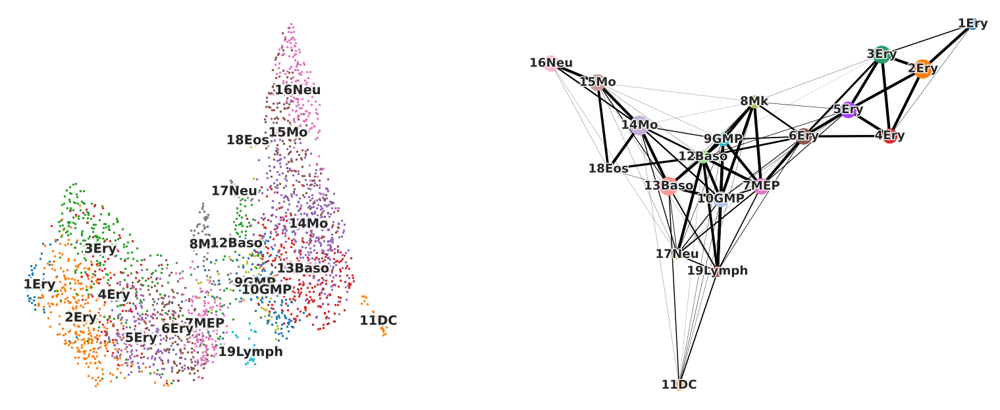
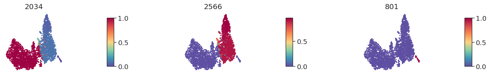
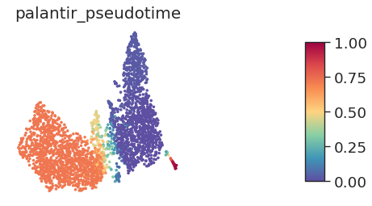
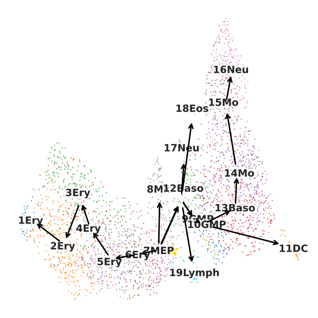

During my internship this past summer, I spent time surveying the many existing trajectory inference (TI) methods. TI methods leverage data from thousands of single cells to reconstruct lineage paths and infer the order of cells along developmental trajectories.  
  
Selecting a method is not trivial. With the many published algorithms available and the rather nonexistent comprehensive assessment of each method, my first task was to identify a handful of promising methods to evaluate. Thanks to this [paper](https://www.nature.com/articles/s41587-019-0071-9) where authors compared 45 TI methods on both real and synthetic data sets to assess performance, scalability, robustness, and useabiliity, I was able to narrow down a list of candidate methods.

Ultimately I moved forward with the following: PAGA (Python), Palantir (Python), and Slingshot (R).

:::fyi
Simply --  
1. PAGA learns topology by partitioning a kNN graph and ordering cells using random-walk-based distances in the PAGA graph.  
2. Palantir uses diffusion-map components to represent the underlying trajectory. It then assigns pseudotime by modeling cell fates as a probabilistic process using a Markov chain  
3. Slingshot infers lineage by taking clustered cells, connecting these clusters using a minimum spanning tree, and then fitting principle curves for each detected branch. A separate pseudotime is calculated for each lineage.
:::

Here, I will walk through the steps I used to identify trajectories and calculate pseudotime for a data set. For simplicity, I will use the _Paul15_ data set (Development of Myeloid Progenitors) provided within `Scanpy`. As a heads up -- since I will be using tools from both R and Python, I will be switching between the two languages in this notebook.  

## Set up   
```{r include=FALSE}
library(reticulate)
use_python('/Users/joy/miniconda3/bin/python')
```

First loading necessary python packages.  
```{python}
import matplotlib.pyplot as plt
import pandas as pd
import scanpy as sc
import scanpy.external as sce
```

Next I load the _paul15_ data set and perform some scripted preprocessing steps, some of which I've discussed in a previous [post](/post/scanpy).  
```{python}
adata = sc.datasets.paul15()
```
```{python}
# preprocessing QC
sc.pp.recipe_zheng17(adata)
# calculate pca
sc.tl.pca(adata)
# compute the neighbor graph
sc.pp.neighbors(adata, n_neighbors = 20)
# calculate umap embedding
sc.tl.umap(adata)
```

Now that the preprocessing is done we can explore the AnnData object. This object contains information for 999 genes across 2730 cells. Any operations performed on the data are also documented. Here we performed log-transformation (log1p), calculated pca, nearest neighbors, and umap. Notice also that within `obs` there is a column names 'paul15_clusters'. This specifies the cluster assignments given to the data.  
```{python}
adata
```

We can visualize the data in umap space and color the cells based on which cluster they fall into. 
```{python}
sc.pl.umap(adata, color='paul15_clusters', legend_loc='on data', title = '')
```

## Identify a start cell
Many trajectory inference methods require the user to specify a cell or cell group as the 'starting cell'. Or in other words, a cell/cell group that is at the least differentiated state. For this analysis, I will use a cell that is within the 7MEP (myeloid erythroid progenitor) cluster.  
```{python}
# using cell within 7MEP cluster 
adata.obs[adata.obs['paul15_clusters']  == '7MEP'][0:6]
```

Here I have listed 6 cells that belong to this cluster. I will arbitrarily choose one to act as the starting cell.  
```{python}
# visualize location of cell on umap
cell = ['48']
umap = pd.DataFrame(adata.obsm['X_umap'][:,0:2], index=adata.obs_names, columns=['x', 'y'])

plt.scatter(umap["x"], umap["y"], s=5, color="lightgrey")
plt.scatter(umap.loc[cell, "x"], umap.loc[cell, "y"], s=30)
```

## Run trajectory inference Methods: PAGA & Palantir
Now I am ready to run the Python TI methods. Below I have defined a function that will run PAGA and Palantir. Notice that only Palantir requires a start cell be specified. 
```{python eval = FALSE}
def run_trajectory(data, clusterby, startcell):
    print('Running PAGA')
    sc.tl.paga(data, groups = clusterby)
    
    print('Calculating Palantir Diffusion maps')
    # using adaptive anisotropic adjacency matrix, instead of PCA projections (default) to compute diffusion components
    sce.tl.palantir(data, n_components = 25, knn = 50, impute_data = False, use_adjacency_matrix = True)
    
    print('Run Palantir')
    start = startcell
    pr_res = sce.tl.palantir_results(data, knn = 50, early_cell = start)
    # add pseudotime and differentiation potential information to anndata object
    data.obs['palantir_pseudotime'] = pr_res.pseudotime
    data.obs['palantir_entropy'] = pr_res.entropy
    
    run_trajectory.pr_res = pr_res.branch_probs
```

:::note
Palantir generates the following results:  
1. Pseudotime: Pseudotime ordering of each cell  
2. Terminal state probabilities: Matrix of cells X terminal states. Each entry represents the probability of the corresponding cell reaching the respective terminal state  
3. Entropy: A quantitative measure of the differentiation potential of each cell computed as the entropy of the multinomial terminal state probabilities  
:::

```{python include=FALSE}
def run_trajectory(data, clusterby, startcell):
    sc.tl.paga(data, groups = clusterby)
```

```{python}
# run methods
run_trajectory(adata, clusterby = 'paul15_clusters', startcell = '48')
```


## Visualize PAGA and Palantir results
```{python eval=FALSE, include=FALSE}
fig, (ax1, ax2) = plt.subplots(1,2, figsize=(20,8))
sc.pl.umap(adata, color='paul15_clusters', legend_loc='on data', title = '', ax = ax1)
sc.pl.paga(adata, colors = 'paul15_clusters', frameon = False, threshold = 0.03, node_size_scale = 2, edge_width_scale=0.5, ax = ax2, fontoutline = 2)
```

On the left is the standard umap with cells colored by cluster identity. On the right is the PAGA graph. Thicker lines represent stronger connections between cell groups. As you would expect, the progenitor cell groups (MEP, GMP) are at the center of the graph. From here, branching correlates with erythroid and myeloid differentiation as we would expect. This matches nicely with the umap embedding as well.

Palantir, on the other hand, identifies terminal cells. Below I've labeled the locations of these terminal cells.  
```{python echo=FALSE}
cells = ['2566','2034','801']
umap = pd.DataFrame(adata.obsm['X_umap'][:,0:2], index=adata.obs_names, columns=['x', 'y'])

plt.scatter(umap["x"], umap["y"], s=5, color="lightgrey")
plt.scatter(umap.loc[cells, "x"], umap.loc[cells, "y"], s=30)
```
  
I can also use the AnnData object to identify which cluster group these terminal cells belong to:
```{python}
adata.obs[adata.obs.index.isin(['2566','2034','801'])]['paul15_clusters']
```

Given these terminal cells, Palantir also calculates terminal state probabilities (see above). These values can be visualized on the umap:  
  
Alternatively, the pseudotime across all cells can be plotted:  
  

## Run Slingshot  
While PAGA and Palantir can be run in Python, in order to run the slingshot algorithm, we must move to R.  

:::note
Slingshot has 2 steps:  
1. Identify lineage structure with a cluster-based minimum spanning tree.  
2. Construct smooth representations of each lineage using simultaneous principal curves 
:::

```{r, warning=FALSE, message=FALSE}
library(slingshot, quietly = T)
library(dplyr)
```

Since I have been handling the single-cell data in AnnData format, I will call the object using the `reticulate` package notation instead of converting the data to a Seurat object. I will use `data` to specify data after dimensional reduction by pca and `clusters` to indicate to which group each cell belongs. 
```{r message=FALSE, warning=FALSE}
data  <- py$adata$obsm['X_pca']
clusters <- py$adata$obs['paul15_clusters'] %>% dplyr::pull()
```

Similar to Palantir, I also specify a starting point. In this case, because Slingshot draws connections between _clusters_ I assign a starting cluster.  
```{r}
results <- slingshot(data, clusterLabels = clusters, start.clus = '7MEP')
```

The output of a slingshot run contains information about each `lineage` path identified by the algorithm. Below I pull this information and convert it to a python object. I then add it to the `.uns` element of the AnnData object. Essentially, this describes the path from the user defined starting cluster (MEP) to all terminal states determined by Slingshot.  
```{r}
results@lineages
lineages <- r_to_py(results@lineages)
```
```{python}
adata.uns['lineages'] = r.lineages
```

### Visualize slingshot results
```{python eval=FALSE, include=FALSE}
def arrow_coords(p1, p2, prop = 0.1):
    x1, y1 = p1
    x2, y2 = p2
    assert prop < 0.5
    slope = (y2 - y1) / (x2 - x1)
    x_orig = ((1 - prop) * x1) + (prop * x2)
    y_orig = y1 + (slope * (x_orig - x1))
    x_dest = (prop * x1) + ((1 - prop) * x2)
    y_dest = y1 + (slope * (x_dest - x1))
    return (x_orig, y_orig), (x_dest, y_dest)

def pathplot(data, paths, identifier='clusters', representation = 'tsne', ax = None):
    if ax is None:
        fig, ax = plt.subplots(figsize=(6, 6))
         
    centroids = pd.concat(
        [pd.DataFrame(data.obsm[f'X_{representation}'], index=data.obs_names, columns=['X_1', 'X_2']), 
         data.obs[identifier]], axis=1).groupby(identifier).mean().to_dict(orient='index')
    data.catplot(identifier, pointsize=0.1, ax=ax, representation = representation)
    for path in paths:
        end_points = path[1:]
        end_points.extend([None])
        for i, orig_group in enumerate(path):
            dest_group = end_points[i]

            if dest_group is not None:
                orig = tuple(centroids[orig_group].values())
                dest = tuple(centroids[dest_group].values())
                if i == 0:
                # draw origin
                    ax.scatter(orig[0] + 1, orig[1], marker = "*", s=320, color='gold')
                arrow_orig, arrow_dest = arrow_coords(orig, dest)
                ax.annotate("", xytext=arrow_orig, xy=arrow_dest,
                 arrowprops=dict(arrowstyle="->", lw=2, color = 'black'))
```
```{python eval=FALSE, include=FALSE}
pathplot(adata, [['7MEP', '12Baso', '9GMP', '10GMP', '13Baso', '14Mo', '15Mo', '16Neu'], 
                ['7MEP', '6Ery', '5Ery', '4Ery', '3Ery', '2Ery', '1Ery'],
                ['7MEP', '12Baso', '9GMP', '10GMP', '11DC'],
                ['7MEP', '12Baso', '17Neu'],
                ['7MEP', '12Baso', '19Lymph'],
                ['7MEP', '12Baso', '18Eos'],
                ['7MEP', '8Mk']], identifier = 'paul15_clusters', representation='umap')
```
For visualization, I can then overlay these paths on the umap. Similar to both PAGA and Palantir, we observe a branching pattern that corresponds with erythroid and myeloid differentiation.


## Wrap up
Over the course of my internship, I used these algorithms to identify trajectories describing potential cell differentiation patterns. While the algorithms themselves are rather straightforward to implement, there are many nuanced difficulties when performing such analyses. A sticking point I found was how to best specify a starting cell. Oftentimes the data I worked with contained differentiated cell types almost exclusively. As such, selecting a cell/cell group to designate as a start point was difficult. Additionally, it is challenging to consider how to integrate study metadata (treatment group, patient id etc.) into this analysis. If samples from 30 patients were collected, how do we estimate cell trajectories? Is it appropriate to group all of the data and find a common trajectory? What about trajectories unique to certain patients? How do we quantify the amount of uncertainty in an estimated lineage path? So many things to consider!! But overall I had a blast learning some new computational techniques and diving into the world of single-cell genomics. 

