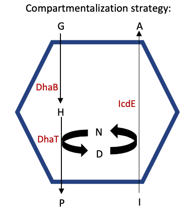
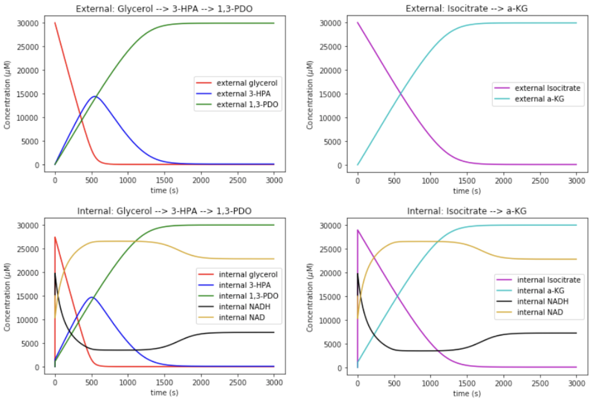

**Overview:**    
Compartmentalization strategies are utilized by various organisms to address problems of toxicity, leakage and byproduct accumulation during metabolism. Bacteria, in particular, have subcellular protein-bound organelles called microcompartments (MCPs) that contain essential enzymes for particular metabolic pathways [[1]](https://doi.org/10.1371/journal.pcbi.1005525). Exploiting this natural tool with metabolic engineering will allow for efficient biosynthesis, particularly in systems requiring redox cofactor recycling (say in high-yield production of biofuels). 

Many of the mechanistic hypotheses regarding MCPs are a challenge to test experimentally as direct measurement of small molecule concentrations in bacterial MCPs remains difficult. Employing a modeling strategy, however, will allow for the effects of the MCP on fluxes and metabolite concentrations to be characterized. Such a model will not only help determine how the MCP impacts thermodynamics across the network, but will also identify when compartmentalization will be most advantageous.

**Objective:**  
The objective was to develop a mathematical model to study the function of a microcompartment in 1,3-propanediol production.   

The 1,3-propanediol (1,3-PDO) pathway is a great candidate for this form of metabolic engineering as the product is used as a building block in the production of many plastics. 1,3-PDO is currently produced from glycerol through chemical synthesis at a high cost due to low selectivity and production of toxic intermediates [[2]](https://www.ncbi.nlm.nih.gov/pmc/articles/PMC184009/). In this pathway, glycerol dehydratase (DhaB) and NADH-dependent 1,3-PDO dehydrogenase (DhaT) reduce glycerol to 1,3-PDO with 3- hydroxy-propionaldehyde (3-HPA) as an intermediate [[3]](https://doi.org/10.1016/j.biotechadv.2010.03.003). Co-compartmentalizing this pathway for the bioconversion of glycerol to 1,3-PDO with enzymes to recycle NAD to NADH should improve the production process and prevent loss of these important redox cofactors.

**Approach:**  

I used a reaction-diffusion model incorporating passive transport across the MCP and the action of the DhaB, DhaT and IcdE enzymes within the MCP. The MCP is modeled as a spherical compartment of radius 100nm in solution (representing same fractional volume as five MCPs in a typical bacterial cell).
The following assumptions are also made:
1. I assume the MCP is spherically symmetrical
2. I consider constant external concentrations of glycerol, Isocitrate and 3-HPA
3. I assume the cofactors NAD+/NADH are unable to permeate the MCP membrane
4. I assume that the DhaB enzyme-catalyzed reactions are irreversible
5. I assume that the DhaT and IcdE enzyme-catalyzed reactions are reversible and have NAD+
or NADH cofactor sequential cofactor binding.
6. I assume solution inside and outside MCP is well mixed (diffusion is negligible).

Inside the MCP, I assume Michaelis-Menten kinetic behavior of the DhaB, DhaT and IcdE enzymes. DhaT and IcdE are redox-coupled by the cycling of NAD+/NADH so I assume ordered bi-bi mechanism. After defining each parameter, I derived non-dimensional equations and integrated the equations in time. These details can be found in the linked pdf at the top of this page.

**Results:**  
I was able to simulate the reaction system using the set of ordinary differential equations I defined above. 

This work lays the foundation for further assesment of the 1,3-propanediol pathway. One may wish to start with a sensitivity analysis to identify whether particular parameters cause significant overall change in the production of a product of interest. In this case, it would be interesting to focus on the intermediate 3-HPA as its accumulation is toxic to bacteria. Furthermore, simulations using the kinetic metabolic model established here can be instrumental in exploring the spatial effects of compartmentalization without extensive experimental tests.

